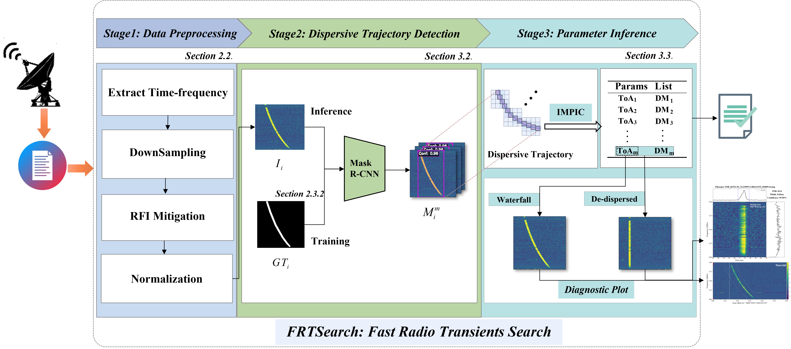

# FRTSearch: Fast Radio Transient Search

[](https://doi.org/10.57760/sciencedb.Fastro.00038) [](https://doi.org/10.57760/sciencedb.Fastro.00038) [](https://github.com/open-mmlab/mmdetection) [](https://www.python.org/) [](./LICENSE)

**FRTSearch** is an end-to-end framework that directly processes radio astronomical observation data to detect and characterize Fast Radio Transients (FRTs), including **Pulsars**, **Rotating Radio Transients (RRATs)**, and **Fast Radio Bursts (FRBs)**. These sources share a universal dispersive morphology ($t \propto \nu^{-2}$) in time-frequency dynamic spectra. FRTSearch exploits this signature to reframe FRT discovery from exhaustive parameter space searches to direct pattern recognition.

<div align="center">
  
</div>

**Core Components:**
1. **Mask R-CNN** — Segments dispersive trajectories in time-frequency dynamic spectra, trained on the pixel-level annotated **CRAFTS-FRT** dataset.
2. **IMPIC** — Iterative Mask-based Parameter Inference and Calibration: infers DM and ToA directly from segmentation masks. &nbsp; [Code](utils/IMPIC.py) | [Docs](utils/IMPIC.md) | [Example](test_sample/test_impic.py)

**Supported formats:**

| Format | 1-bit | 2-bit | 4-bit | 8-bit | 32-bit |
|--------|:-----:|:-----:|:-----:|:-----:|:------:|
| [PSRFITS](https://www.atnf.csiro.au/research/pulsar/psrfits_definition/Psrfits.html) (`.fits`) | ✅ | ✅ | ✅ | ✅ | — |
| [Sigproc Filterbank](http://sigproc.sourceforge.net) (`.fil`) | ✅ | ✅ | ✅ | ✅ | ✅ |

## Installation

### Option 1: From Source

> Requires: Python 3.10+, PyTorch 2.0+, CUDA 11.7+

```bash
git clone https://github.com/BinZhang109/FRTSearch.git && cd FRTSearch

# MMDetection
pip install -U openmim && mim install mmcv-full && pip install mmdet

# Other dependencies
pip install -r requirements.txt
```

### Option 2: Docker

```bash
docker pull binzhang/FRTSearch
```

### Download Model Weights

Download from [Hugging Face](https://huggingface.co/waterfall109/FRTSearch/tree/main/models) and place into `models/`:

```
FRTSearch/
├── models/
│   └── hrnet_epoch_36.pth
├── configs/
│   └── detector_FAST.py
└── ...
```

## Usage

### Full Pipeline

```bash
python FRTSearch.py <data.fits|data.fil> <config.py> [--slide-size 128]
```

| Argument | Description |
|----------|-------------|
| `data` | Observation file (`.fits` or `.fil`) |
| `config` | Detector configuration file |
| `--slide-size` | Subintegrations per sliding window (default: 128) |

### Example

Test data can be downloaded from [Hugging Face](https://huggingface.co/waterfall109/FRTSearch/tree/main/test_sample).

```bash
# FAST FRB detection
python FRTSearch.py ./test_sample/FRB20121102_0038.fits ./configs/detector_FAST.py --slide-size 128

# SKA FRB detection
python FRTSearch.py ./test_sample/FRB20180119_SKA_1660_1710.fil ./configs/detector_SKA.py --slide-size 8
```

### Test Samples

<!-- More predefined test cases are available via `test_sample/test_samples.py`: -->

```bash
python test_sample/test_samples.py --example FRB20121102
```

Available examples: `FRB20121102`, `FRB20201124`, `FRB20180301`, `FRB20180119`, `FRB20180212`

## Dataset: CRAFTS-FRT

The first pixel-level annotated FRT dataset, derived from the Commensal Radio Astronomy FAST Survey (CRAFTS).

| Instances | Source | Download |
|-----------|--------|----------|
| 2,392 (2,115 Pulsars, 15 RRATs, 262 FRBs) | FAST 19-beam L-band | [ScienceDB](https://doi.org/10.57760/sciencedb.Fastro.00038) |

## Citation

```bibtex
@article{zhang2025frtsearch,
  title={FRTSearch: Unified Detection and Parameter Inference of Fast Radio Transients},
  author={Zhang, Bin and Wang, Yabiao and Xie, Xiaoyao and others},
  year={2025}
}
```

**Test sample references:** FAST — [Guo et al. (2025)](https://doi.org/10.3847/1538-4365/adf42d) &nbsp;|&nbsp; SKA — [Shannon et al. (2018)](https://doi.org/10.1038/s41586-018-0588-y)

## Contributing

[Open an Issue](https://github.com/BinZhang109/FRTSearch/issues) for bugs or questions. PRs welcome — see [Contributing Guidelines](CONTRIBUTING.md).

## License & Acknowledgments

This project is licensed under [GPL-2.0](./LICENSE).

Built upon: [MMDetection](https://github.com/open-mmlab/mmdetection) | [PRESTO](https://github.com/scottransom/presto)

<div align="center">
  <sub>Exploring the dynamic universe with AI 🌌📡</sub>
</div>
