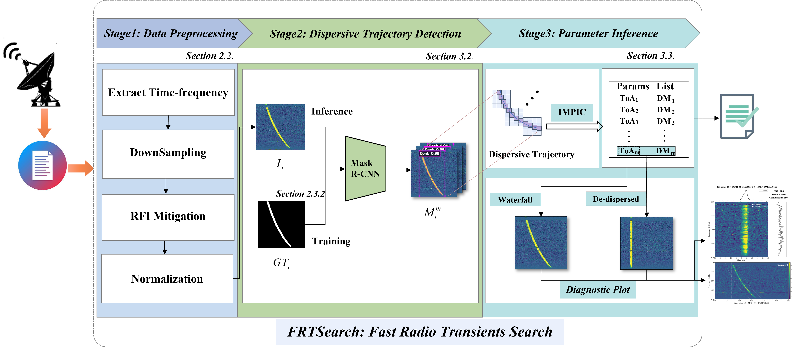

# FRTSearch: Fast Radio Transient Search

[](https://pypi.org/project/FRTSearch/) [](https://doi.org/10.57760/sciencedb.Fastro.00038) [](https://doi.org/10.57760/sciencedb.Fastro.00038) [](https://github.com/open-mmlab/mmdetection) [](https://www.python.org/) [](./LICENSE)

**FRTSearch** is an end-to-end framework for discovering **Pulsars**, **Rotating Radio Transients (RRATs)**, and **Fast Radio Bursts (FRBs)** in radio astronomical observation data. Single-pulse emissions from these sources all exhibit consistent dispersive trajectories governed by the cold plasma dispersion relation ($t \propto \nu^{-2}$) in time-frequency dynamic spectra. This shared signature serves as a key beacon for identifying these astrophysical sources. FRTSearch leverages a Mask R-CNN instance segmentation model and the IMPIC algorithm to directly detect and characterize Fast Radio Transients (FRTs), infer their physical parameters (DM, ToA), and generate diagnostic plots and candidate catalogs for manual verification and scientific analysis.

<div align="center">
  
</div>

**Core Components:**
1. **Mask R-CNN** — Segments dispersive trajectories in time-frequency dynamic spectra, trained on the pixel-level annotated **CRAFTS-FRT** dataset.
2. **IMPIC** — Iterative Mask-based Parameter Inference and Calibration: infers DM and ToA directly from segmentation masks. &nbsp; [Code](utils/IMPIC.py) | [Docs](utils/IMPIC.md) | [Example](test_sample/test_impic.py)

**Supported formats:**

| Format | 1-bit | 2-bit | 4-bit | 8-bit | 32-bit |
|--------|:-----:|:-----:|:-----:|:-----:|:------:|
| [PSRFITS](https://www.atnf.csiro.au/research/pulsar/psrfits_definition/Psrfits.html) (`.fits`) | ✅ | ✅ | ✅ | ✅ | — |
| [Sigproc Filterbank](http://sigproc.sourceforge.net) (`.fil`) | ✅ | ✅ | ✅ | ✅ | ✅ |

## Installation

### Option 1: pip install (Recommended)

> Requires: Python 3.10+, CUDA 11.7+, PyTorch 2.0+, [PRESTO](https://github.com/scottransom/presto), [MMDetection](https://github.com/open-mmlab/mmdetection)

```bash
pip install FRTSearch
```

### Option 2: From Source

```bash
git clone https://github.com/BinZhang109/FRTSearch.git && cd FRTSearch
pip install -r requirements.txt
```

### Option 3: Docker

```bash
docker pull binzhang109/frtsearch:v1.0.0
```

### Download Model Weights

Download from [Hugging Face](https://huggingface.co/waterfall109/FRTSearch/tree/main/models) and place into `models/`:

```
FRTSearch/
├── models/
│   └── hrnet_epoch_36.pth
├── configs/
│   ├── detector_FAST.py
│   └── detector_SKA.py
└── ...
```

## Usage

### Full Pipeline

```bash
python FRTSearch.py <data.fits|data.fil> <config.py> [--slide-size 128]
```

| Argument | Description |
|----------|-------------|
| `data` | Observation file (`.fits` or `.fil`) |
| `config` | Detector configuration file |
| `--slide-size` | Subintegrations per sliding window (default: 128) |

### Example

Test data can be downloaded from [Hugging Face](https://huggingface.co/waterfall109/FRTSearch/tree/main/test_sample).

```bash
# FAST FRB detection
python FRTSearch.py ./test_sample/FRB20121102_0038.fits ./configs/detector_FAST.py --slide-size 128

# SKA FRB detection
python FRTSearch.py ./test_sample/FRB20180119_SKA_1660_1710.fil ./configs/detector_SKA.py --slide-size 8
```

### Training

Download the [CRAFTS-FRT dataset](https://doi.org/10.57760/sciencedb.Fastro.00038) and place it into `CRAFTS_FRT_Dataset/` before training.

```bash
python train.py
```

### Test Samples

<!-- More predefined test cases are available via `test_sample/test_samples.py`: -->

```bash
python test_sample/test_samples.py --example FRB20121102
```

Available examples: `FRB20121102`, `FRB20201124`, `FRB20180301`, `FRB20180119`, `FRB20180212`

## Dataset: CRAFTS-FRT

The first pixel-level annotated FRT dataset, derived from the Commensal Radio Astronomy FAST Survey (CRAFTS).

| Instances | Source | Download |
|-----------|--------|----------|
| 2,392 (2,115 Pulsars, 15 RRATs, 262 FRBs) | FAST 19-beam L-band | [ScienceDB](https://doi.org/10.57760/sciencedb.Fastro.00038) |

## Citation

```bibtex
@article{zhang2026frtsearch,
  title={FRTSearch: Unified Detection and Parameter Inference of Fast Radio Transients using Instance Segmentation },
  author={Zhang, Bin and Wang, Yabiao and Xie, Xiaoyao et al.}
  year={2026},
}
```

**Test sample references:** FAST — [Guo et al. (2025)](https://doi.org/10.3847/1538-4365/adf42d) &nbsp;|&nbsp; SKA — [Shannon et al. (2018)](https://doi.org/10.1038/s41586-018-0588-y)

## Contributing

[Open an Issue](https://github.com/BinZhang109/FRTSearch/issues) for bugs or questions. PRs welcome — see [Contributing Guidelines](CONTRIBUTING.md).

## License & Acknowledgments

This project is licensed under [GPL-2.0](./LICENSE).

Built upon: [MMDetection](https://github.com/open-mmlab/mmdetection) | [PRESTO](https://github.com/scottransom/presto)

<div align="center">
  <sub>Exploring the dynamic universe with AI 🌌📡</sub>
</div>
