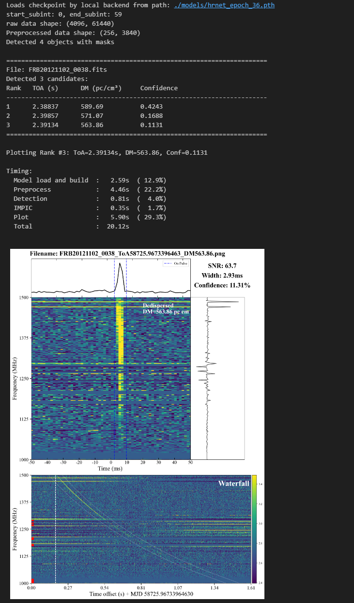

# Test Samples

## Data Access

All test observation files are hosted at: **https://huggingface.co/waterfall109/FRTSearch/tree/main/test_sample**

> **Note:** SKA raw files have very long integration times (>2000s). We extracted ~50s segments around each known signal arrival time to reduce file size. The trimmed files are available at the same repository.

## Dataset

| Source | Telescope | Sampling (μs) | Freq (MHz) | Channels | DM (pc cm⁻³) | ToA (s) | bits |
|:---|:---:|---:|:---:|---:|---:|---:|---:|
| FRB20121102 | FAST | 98.304 | 1000–1500 | 4096 | 565.0 | 2.39 | 8 |
| FRB20180301 | FAST | 49.152 | 1000–1500 | 4096 | 420.0 | 2.83 | 8 |
| FRB20201124 | FAST | 49.152 | 1000–1500 | 4096 | 525.0 | 1.11 | 8 |
| FRB20180119 | SKA | 1266.469 | 1130–1465 | 336 | 402.0 | 1679.6 | 8 |
| FRB20180212 | SKA | 1266.469 | 1130–1465 | 336 | 167.0 | 1848 | 8 |


**References:** FAST — [Guo et al. (2025)](https://doi.org/10.3847/1538-4365/adf42d); SKA — [Shannon et al. (2018)](https://doi.org/10.1038/s41586-018-0588-y)

## Quick Start

```bash
# Run a predefined example (available: FRB20121102, FRB20201124, FRB20180301, FRB20180119, FRB20180212)
python test_sample/test_samples.py --example FRB20121102
```

Results are also available interactively in `test_samples.ipynb`.

## Hyperparameter Tuning

The model is trained on **256 (freq) × 8192 (time)** inputs. Adjust `downsample_time`, `downsample_freq`, and `--slide-size` so the effective input matches this constraint:

$$\text{slide\\_size} \times 1024 ~/~ \text{downsample\\_time} \leq 8192$$

### Preset Configurations

| | FAST | SKA |
|:---|:---:|:---:|
| **Config** | `detector_FAST.py` | `detector_SKA.py` |
| **downsample_freq** | 16 | 1 |
| **downsample_time** | 16 | 1 |
| **--slide-size** | 128 | 8 |
| **Effective time** | 128×1024/16 = 8192 | 8×1024/1 = 8192 |

### Key Rules

1. **Time dimension:** effective window size must be **≤ 8192** after downsampling
2. **Freq dimension:** target **≈ 256** bins (higher like 336 is fine; avoid very low values)
3. **Freq range:** always set `freq_range` to match your observation data

## Example Output


